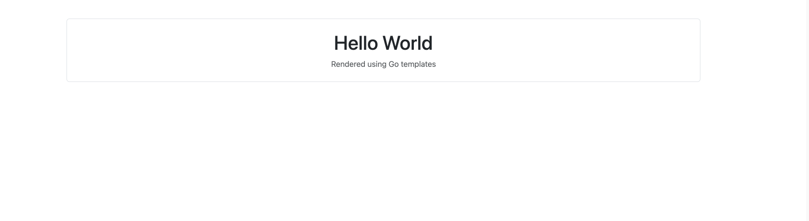
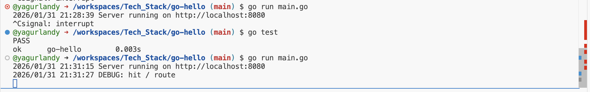
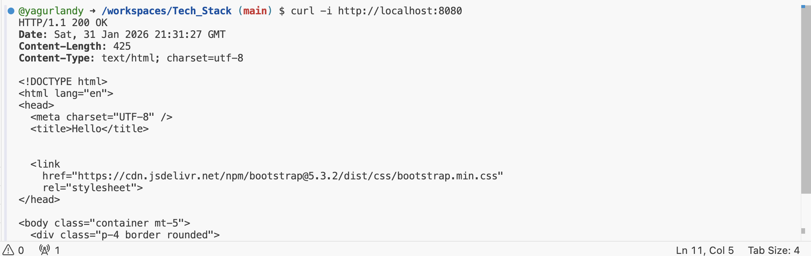

# Go Hello World – Tech Stack Survey

This project is a minimal full-stack “Hello World” web application built in Go as part of the **03.02 Tech Stack Survey** assignment.  
It demonstrates server-side rendering, basic routing, UI styling, testing, and debugging using Go’s standard library.


## Tech Stack

- **Backend language:** Go
- **Web framework:** `net/http` (Go standard library)
- **Templating:** `html/template`
- **UI framework:** Bootstrap (via CDN)
- **Testing:** Go built-in `testing` and `httptest`
- **Debugging:** Log output (`log.Println`) and request tracing


## Running the Application Locally

1. Make sure Go is installed:
```
go version
```
2. Run the server:
```
go run main.go
```
3. The server will start on port 8080:
```
Server running on http://localhost:8080
```
4. Open the application:

- In a local environment: visit http://localhost:8080

- In GitHub Codespaces: forward port 8080 and open the forwarded URL

## Application Behavior
- A single route (/) is defined using http.HandleFunc

- Requests to / render an HTML page using Go’s template engine

- The page displays “Hello World” and is styled with Bootstrap

## Testing
This project includes one automated unit test.

Run tests with:

```
go test
```
Expected output:

```
PASS
ok  	go-hello	0.00s
```
The test verifies:

- The route returns HTTP 200

- The response body contains “Hello World”

## Debugging
Debugging is demonstrated using log output.

Inside the request handler:
```
log.Println("DEBUG: hit / route")
```
When the page is loaded, this message appears in the terminal, confirming that the request reached the handler and allowing request flow tracing.

While the server was running in one terminal session, a second terminal was opened
to send requests to the application using `curl`:

```bash
curl -i http://localhost:8080
```

## Screenshots

The following screenshots demonstrate that all assignment requirements are met:

### 1. Server running locally
Terminal output showing `go run main.go` with the server successfully starting on port 8080.


---

### 2. Rendered Hello World page
Browser view of the application displaying “Hello World,” rendered using Go templates and styled with Bootstrap.



---

### 3. Automated test results
Terminal output showing `go test` with a passing result, confirming the route returns HTTP 200 and expected content.


---

### 4. Debugging evidence
Terminal output displaying the debug log message (`DEBUG: hit / route`) when the page is requested, demonstrating request tracing and debugging.





---

### 5. Port forwarding (Codespaces)
VS Code Ports tab showing port 8080 forwarded and accessible via a public URL.


## Notes
- This project uses server-side rendering (no client-side JavaScript required)

- Bootstrap is loaded via CDN for simplicity

- The application is compatible with Linux and suitable for deployment on AWS EC2