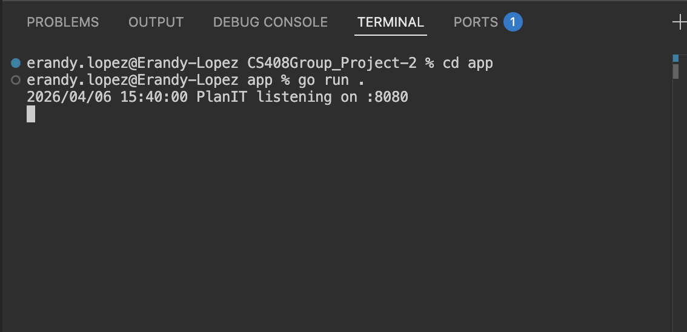
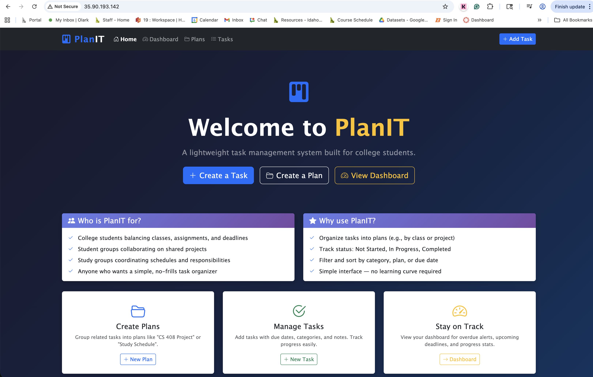
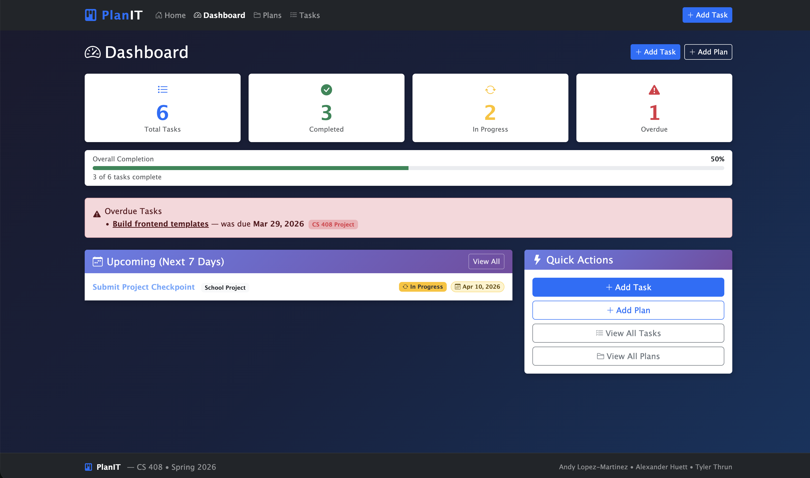
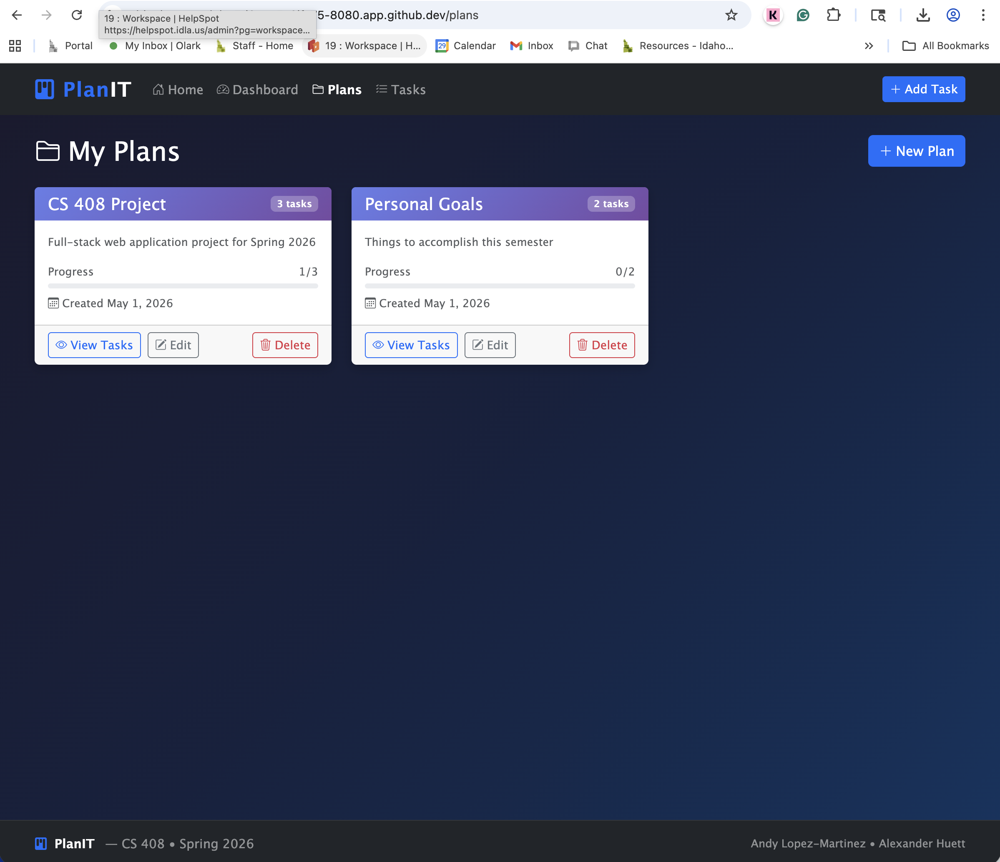
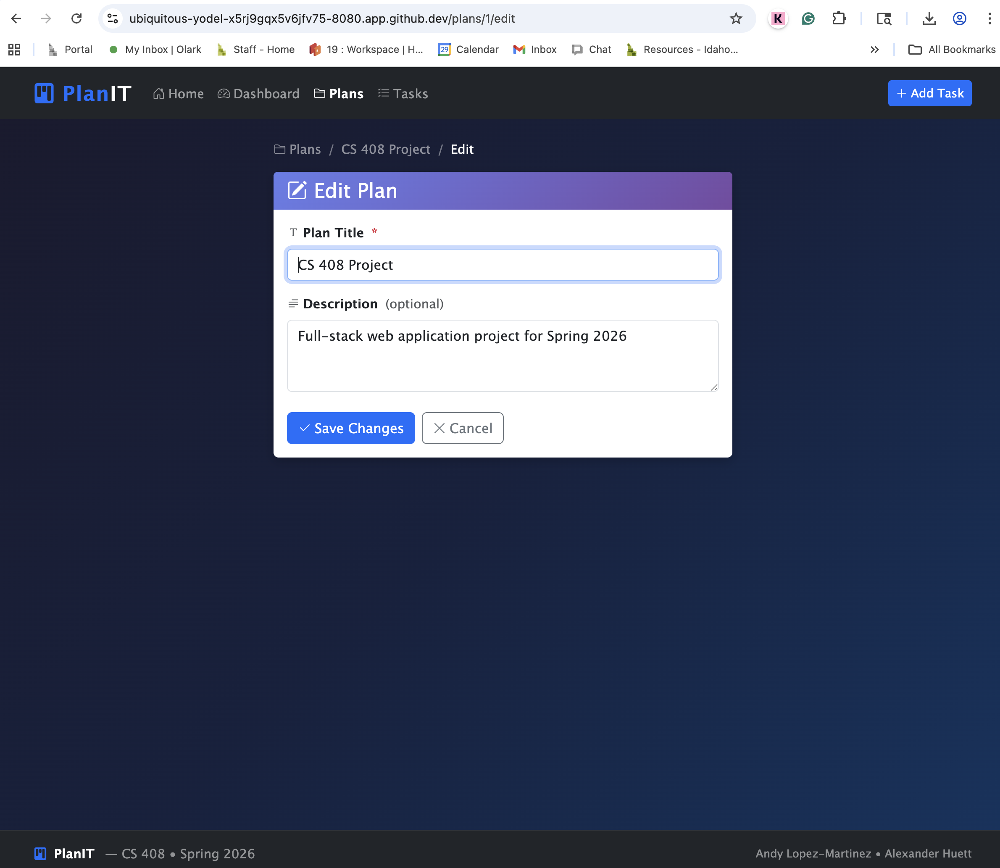
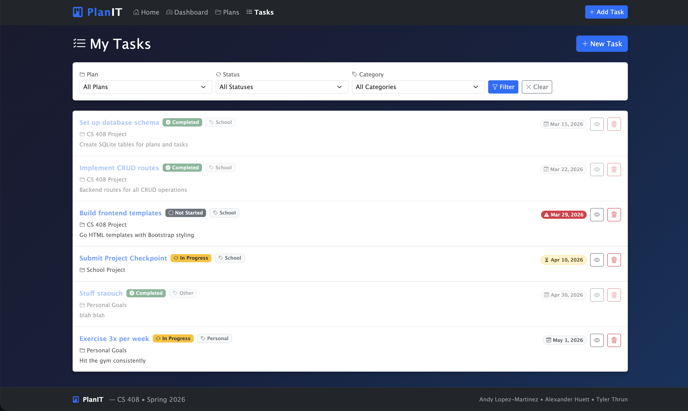
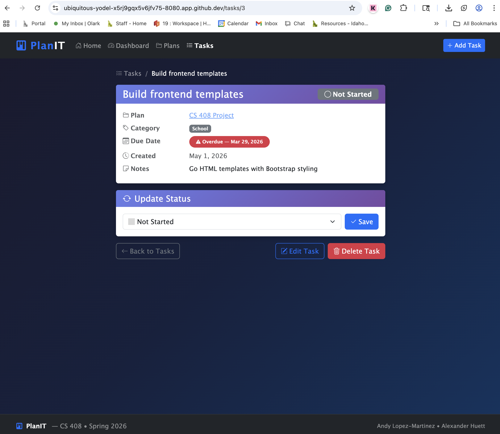
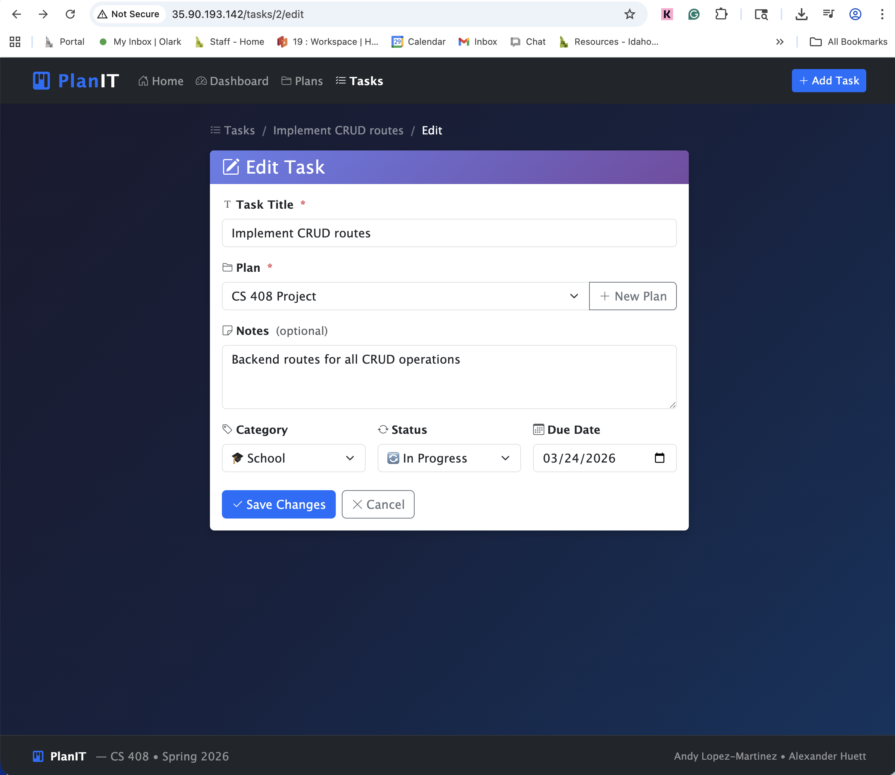
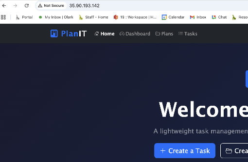

# PlanIT – Full Stack Go Task Manager

This project is a full-stack web application built in Go for **CS 408**. It allows users to organize tasks into plans, track progress, view deadlines, and manage work through a clean server-rendered interface.

The application runs locally on port **8080** and is deployed on AWS EC2 at **http://35.90.193.142/**.

## Tech Stack

- **Backend language:** Go
- **Web framework:** `net/http` (Go standard library)
- **Templating:** `html/template`
- **Database:** SQLite
- **Database driver:** `modernc.org/sqlite`
- **UI framework:** Bootstrap (via CDN)
- **Icons:** Bootstrap Icons
- **Testing:** Go built-in `testing`
- **End-to-end testing:** Playwright
- **Containerization:** Docker and Docker Compose
- **Deployment:** AWS EC2 with nginx reverse proxy
- **Security:** CSRF protection and secure HTTP response headers

## Features

- Create, edit, and manage plans
- Create, view, edit, and manage tasks
- Assign tasks to a plan
- Track task status as Not Started, In Progress, or Completed
- Add due dates, notes, and categories to tasks
- Filter tasks by plan, status, and category
- View a dashboard with total, completed, in-progress, overdue, and upcoming tasks
- Custom 404 page
- Responsive Bootstrap-based UI
- CSRF-protected form submissions
- Basic security headers for safer browser behavior

## Project Structure

`CS408Group_Project/`  
`  app/`  
`    main.go`  
`    go.mod`  
`    go.sum`  
`    Dockerfile`  
`    package.json`  
`    playwright.config.js`  
`    database/`  
`    handlers/`  
`    templates/`  
`    static/`  
`    tests/`  
`    data/`  
`  nginx/`  
`  docs/`  
`  lib/`  
`  Dockerfile`  
`  docker-compose.yml`  
`  docker-compose-template.yml`  
`  dev.sh`  
`  README.md`

## Running the Application Locally

### 1. Make sure Go is installed

`go version`

### 2. Start the app

From the repo root:

`cd app && go run .`

### 3. Open the app

In a local environment, visit **http://localhost:8080**

In GitHub Codespaces:
- forward port **8080**
- open the forwarded URL from the Ports tab

## Running with Docker

From the repo root:

`docker compose up --build`

Then open **http://localhost** in your browser.

## AWS EC2 Deployment

The application is deployed on AWS EC2 and accessible at:

**http://35.90.193.142/**

The deployment uses:
- Docker Compose
- nginx reverse proxy
- port 80 mapped to the app running internally on port 8080

## Application Behavior

### Home Page

The landing page introduces PlanIT and provides navigation to:
- Dashboard
- Plans
- Tasks
- Create Plan
- Create Task

### Plans

Users can:
- create new plans
- view all plans
- open a single plan
- edit plan details
- delete a plan

### Tasks

Users can:
- create tasks
- view all tasks
- open a single task to view task details
- assign tasks to plans
- edit task details
- update task status
- delete tasks
- filter tasks by plan, category, and status

### Dashboard

The dashboard displays:
- total task count
- completed task count
- in-progress task count
- overdue task count
- upcoming tasks due within the next 7 days

## Security

PlanIT includes basic security protections for the server-rendered forms and browser responses.

The app uses:
- CSRF tokens for form submissions
- secure response headers, including content type protection, frame protection, referrer policy, and content security policy
- `.gitignore` rules to keep local databases, test databases, logs, environment files, and generated test output out of version control

## Testing

### Go unit tests

`cd app && go test ./...`

Tests cover all database operations: create, retrieve, update, delete for both plans and tasks, filtering, stats, and seed/clear helpers.

### Playwright end-to-end tests

`cd app && npm install && npx playwright install chromium && npx playwright test`

In GitHub Codespaces or a fresh Linux environment, Playwright may also need browser system dependencies:

`sudo npx playwright install-deps chromium`

The e2e tests verify:
- landing page loads with correct title and heading
- navigation links are present (Plans, Tasks, Dashboard)
- call-to-action buttons link to create plan and create task forms
- plans page renders and create/edit plan forms work end-to-end
- tasks page renders with filter controls
- dashboard displays stats
- 404 page returns HTTP 404 for unknown routes

### CI

GitHub Actions runs both test suites on every push and pull request. The workflow is defined in [.github/workflows/ci.yml](.github/workflows/ci.yml). Playwright reports are uploaded as artifacts on every run.

## Debugging

Debugging and runtime verification were done using:
- terminal logs
- `curl`
- Docker logs
- browser testing
- Playwright

Example local test:

`curl http://localhost:8080`

Example EC2 verification:

`docker compose logs --tail=100`

Successful deployment logs show:

`PlanIT listening on :8080`

## Screenshots

### 1. Local app running

Terminal showing:

`cd app && go run .`

### 2. Home page

Browser view of the PlanIT landing page

### 3. Dashboard

Browser view of task stats and upcoming tasks

### 4. Plans page

Browser view listing created plans

### 5. Edit Plans page

Browser view editing plans

### 6. Tasks page

Browser view listing tasks and filters

### 7. View Task page

Browser view showing an individual task and its details

### 8. Edit Tasks page

Browser view editing tasks

### 9. EC2 deployment

Browser showing:

**http://35.90.193.142/**

## Notes

- This project uses **server-side rendering**
- Bootstrap is loaded through a CDN
- SQLite is used for lightweight persistent storage
- Development seed data is inserted automatically outside production mode
- The app defaults to port **8080**
- The project is compatible with Linux and deployable on AWS EC2
- Local test data, test databases, and Playwright output are ignored through `.gitignore`