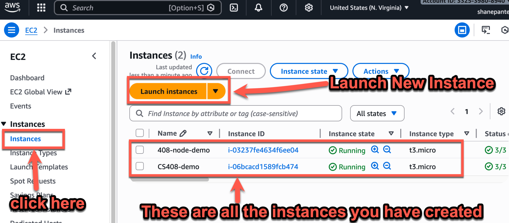
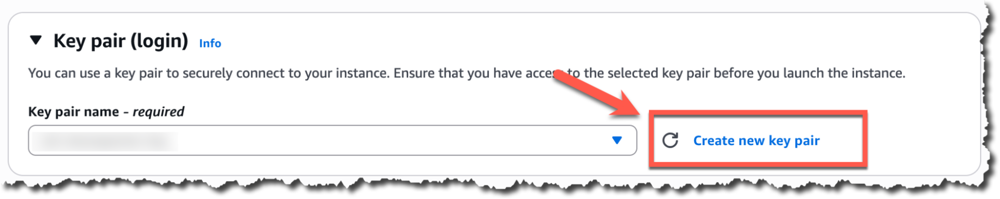
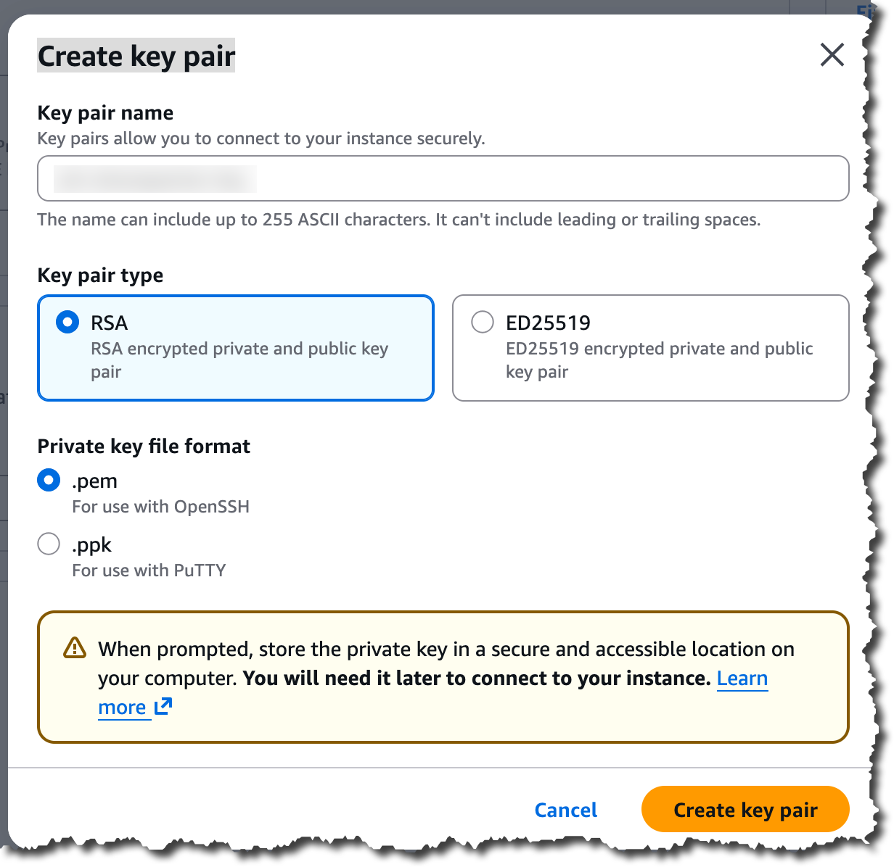
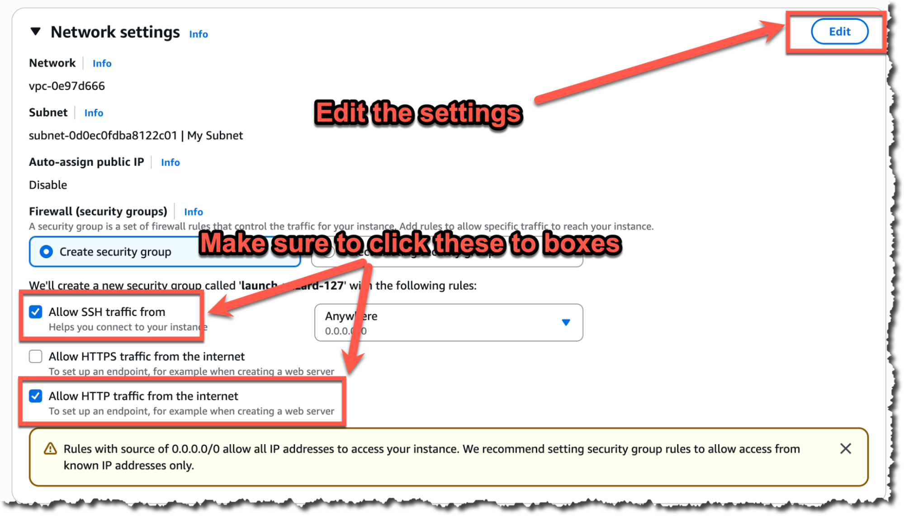
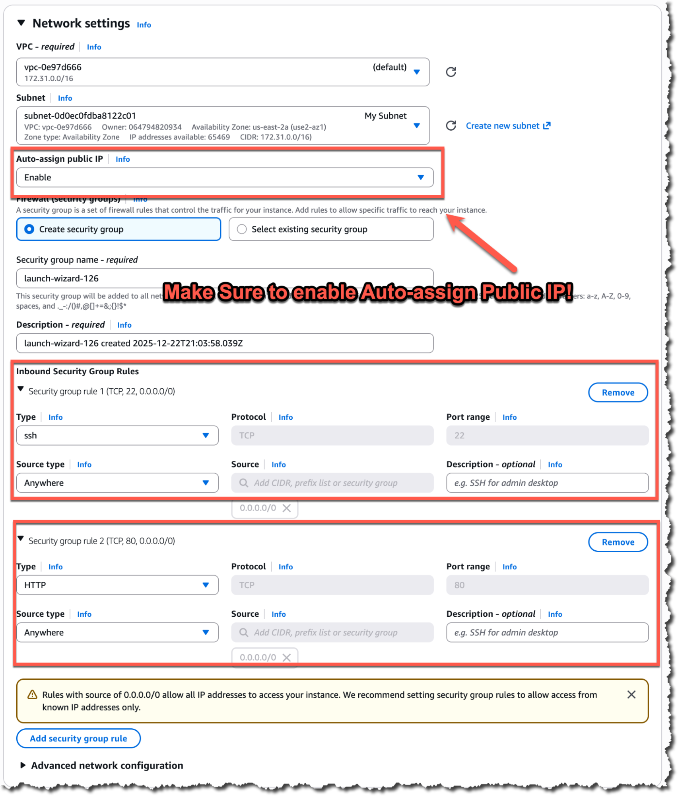
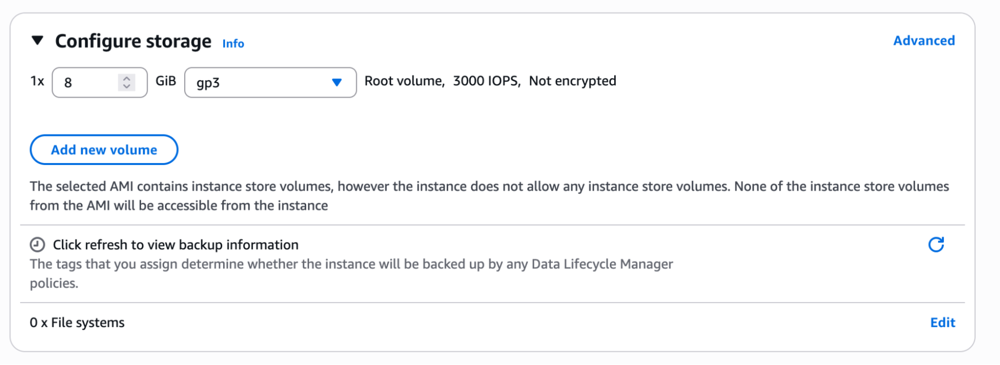
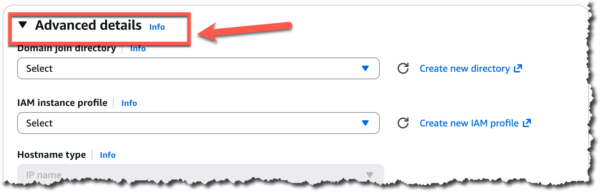
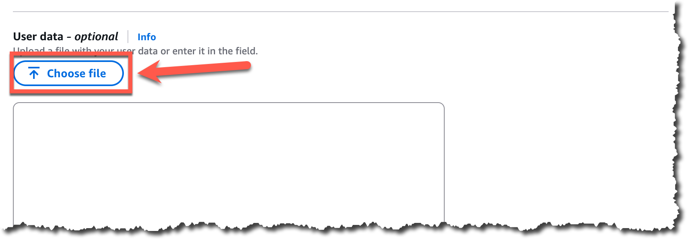
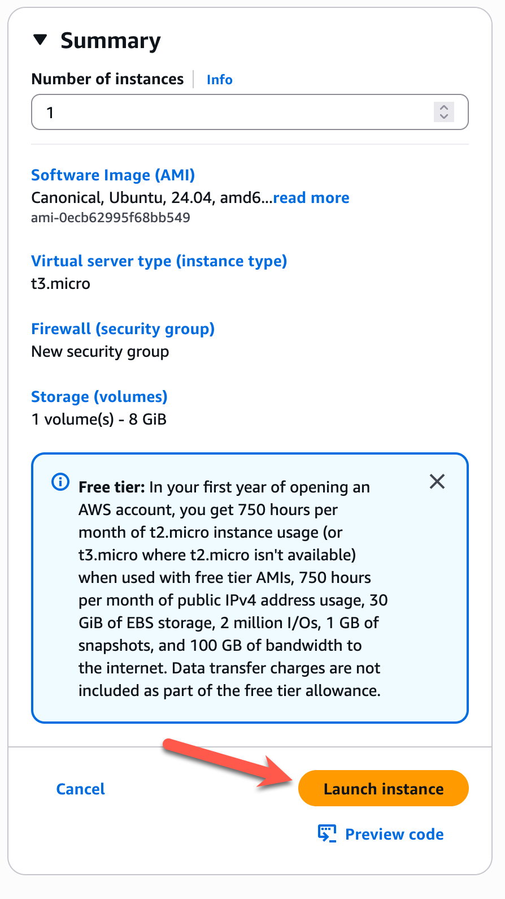

# Launching your EC2 Instance

These instructions are for launching an AWS EC2 instance if you have an Apple
Silicon based Mac (M1/M2) (arm64 architecture) or an Intel/AMD based Machine
(amd64/x86 architecture).

## Open the Amazon EC2 console.

Go to [https://console.aws.amazon.com/ec2/](https://console.aws.amazon.com/ec2/) and select the Instance from the left-hand navigation menu.

## **Application and OS Images (Amazon Machine Image)**

- [Apple Silicon based Mac (M1/M2) (arm64 architecture) Instructions](arm64.md)
- [Intel/AMD based Machine (amd64/x86 architecture) Instructions](amd64.md)

## Key pair (login)

* Name the key: classnumber-yourname-sshkey.
  * Example: cs123-shanepanter-ec2
* Your public key is stored in AWS, and your **private** key is downloaded.
* Save the downloaded private key in a safe place. Don’t commit your private key to your GitHub repository or your server will be compromised.
* Since all students share the AWS account, you can see other students' **public** keys in the interface. A **public** key is only helpful if you have the **private** key. You can share your **public** key with anyone. You must treat your **private** key (the one that was downloaded) like your bank account password or ATM PIN number

## Network settings

* **Network settings:**
  * Allow SSH and HTTP to your instance
  * Auto-assign a public IP

## Storage

Keep the default settings

## Advanced Details

Open up the **Advanced details** and upload the configuration file to install Docker and other necessary packages.

* User data: [`install-docker.sh`](install-docker.sh)

## Launch the Instance

