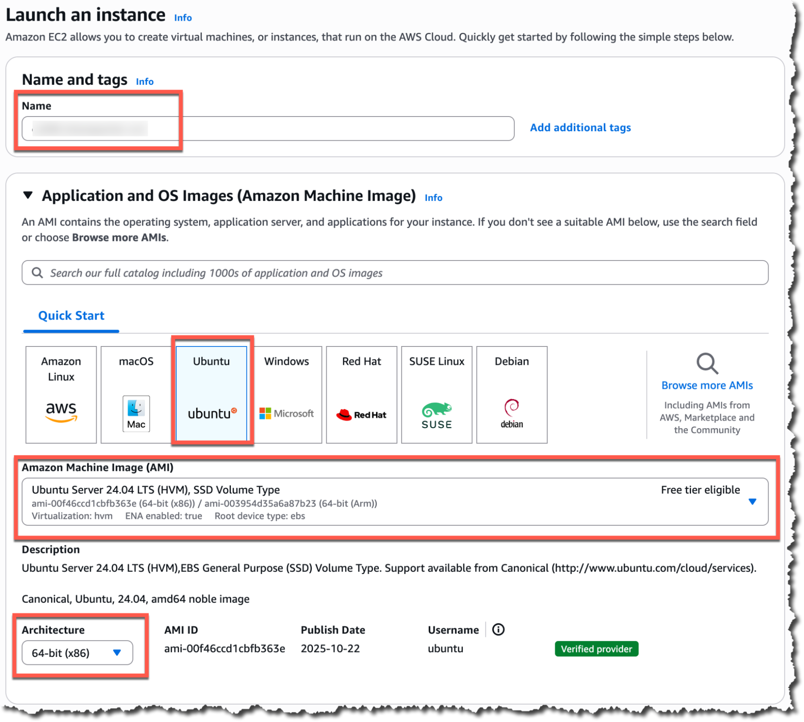
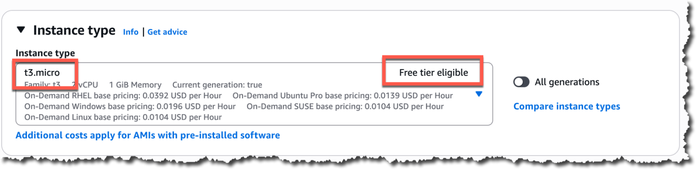

# Launching your EC2 Instance (AMD64/x86)

These instructions are for launching an AWS EC2 instance on an Intel/AMD based
machine (amd64/x86 architecture).

## **Application and OS Images (Amazon Machine Image)**

* **Name and tags**: classname-yourname-ec2
* **Amazon Machine Image (AMI)**: Ubuntu
* **Instance type**: t3.micro
* **Architecture**: 64-bit(x86)

## Instance type

* **Instance type**: t3.micro

