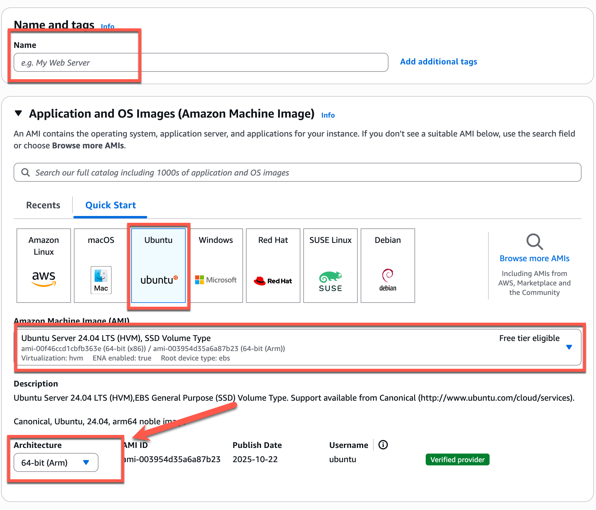
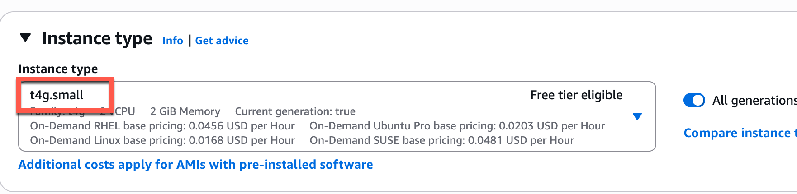

# Launching your EC2 Instance (ARM64)

These instructions are for launching an AWS EC2 instance if you have an Apple
Silicon based Mac (arm64 architecture). IF you have an Intel/AMD based
machine, please follow the [AMD64 instructions](amd64.md).

**NOTE:** You are still launching an ubuntu server instance, you are just selecting
an instance type that supports the arm64 architecture so that it is compatible
with your local development environment.

## **Application and OS Images (Amazon Machine Image)**

* **Name and tags**: classname-yourname-ec2
* **Amazon Machine Image (AMI)**: Ubuntu
* **Architecture**: 64-bit(Arm)

## Instance type

* **Instance type**: t4g.small

