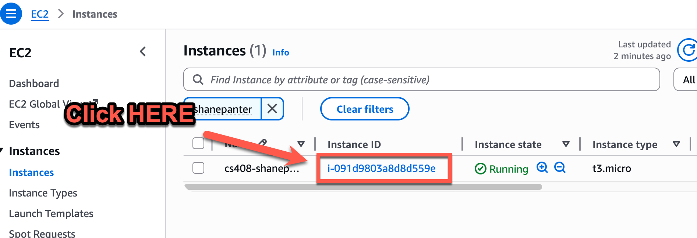
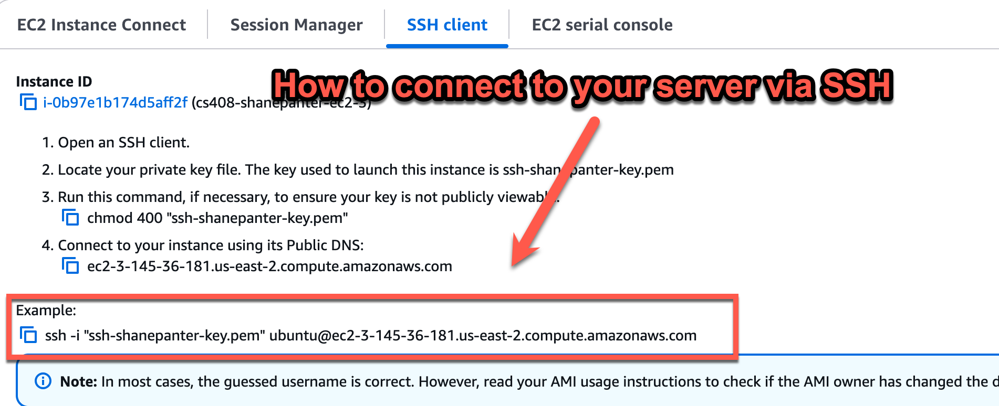
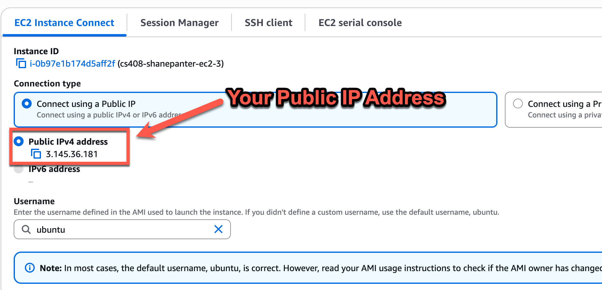
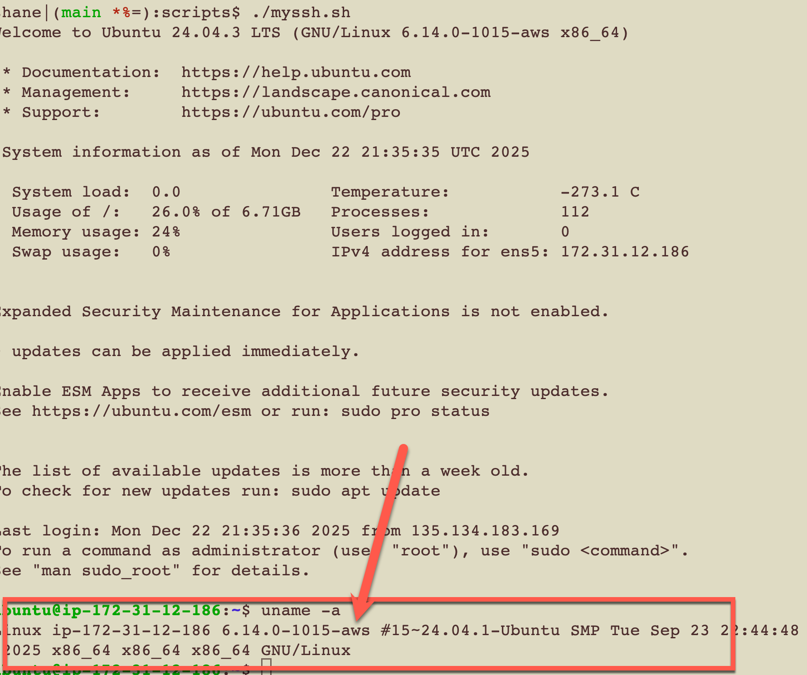
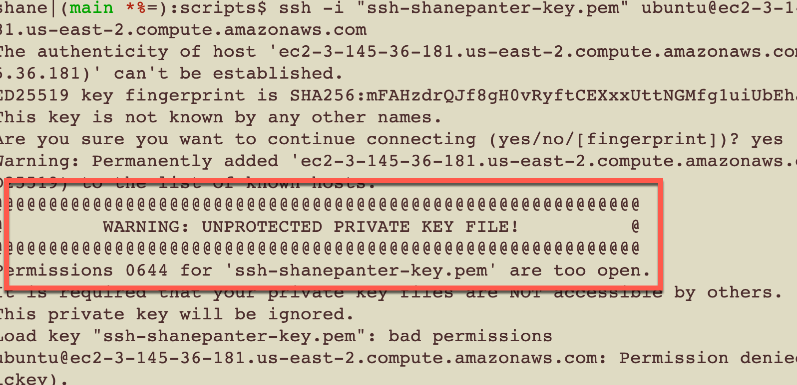

# SSH into your EC2 Instance

## Find your EC2 instance that you created.

---

## Get the connection info for your EC2 instance

## SSH Connection

## Public IP Address

## SSH into your EC2 instance

* Open up a terminal and set the correct permissions on your key.
  * chmod 400 ssh-yourname-key.pem
* Now ssh with the command you copied in the steps above
* Run uname \-a to confirm you are logged into your server

## Troubleshooting

If you see the error below you did not set the correct permissions on your key. Go back and read the previous section and follow each step carefully.

